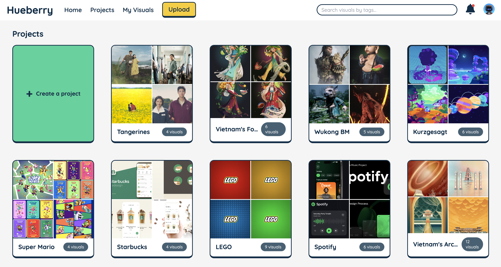
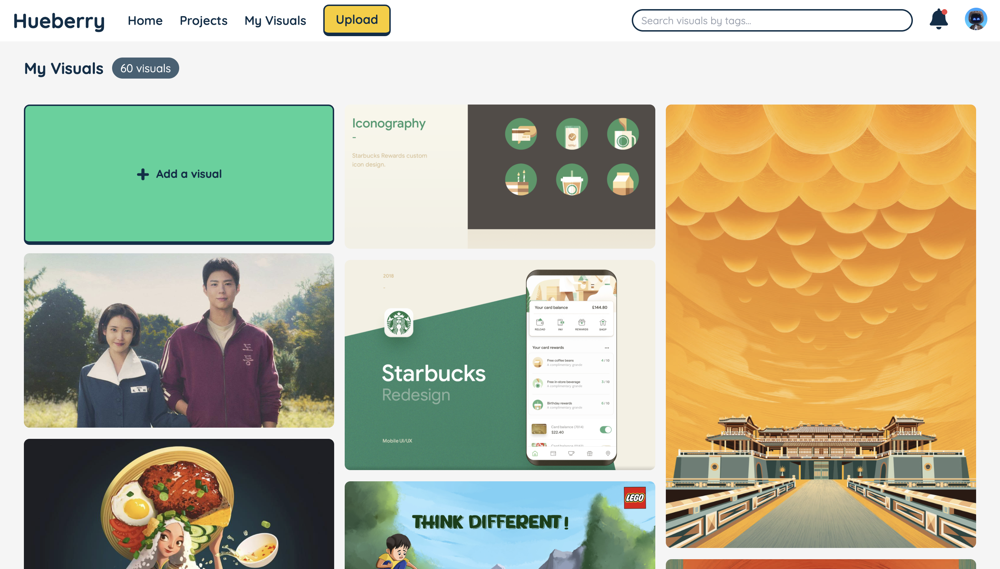

# Hueberry

[Check out Hueberry here](https://hueberry-3fc9d323e30c.herokuapp.com/)

## Backstory

While working as a cashier for Target, I noticed that beyond their iconic red, they used a variety of accent colors that appeared throughout the store. I wondered how their designers ensure that their content consistently follows brand guidelines—not just which colors to use, but in what proportions? This inspired me to create Hueberry, a color analytics platform that automatically extracts, quantifies, and organizes color data from visual assets, helping teams maintain precise brand consistency without the guesswork.

## Screenshots

## Getting Started

* [Planning materials - Trello](https://trello.com/b/S5EWF8lt/hueberry-color-analytics-platform/)

## Key Features

- **Color Analytics**: Automatically extracts and analyzes color palettes from uploaded images using advanced algorithms
- **Visual Organization**: Create projects to group and categorize visual assets for improved management
- **Color Insights**: View detailed color breakdown for each asset with exact hex codes and proportions
- **Masonry Gallery View**: Browse your visual assets in a beautiful, responsive grid layout
- **Project Management**: Organize visuals into projects for better organization and analysis
- **Cloud Storage**: Secure cloud storage for all visual assets using Cloudinary integration
- **User Authentication**: Secure login system with Passport.js protecting your valuable brand assets
- **Responsive Design**: Fully optimized experience across desktop and mobile devices
- **Custom Tagging**: Add tags to assets for improved organization and searchability
- **Asset Details**: View comprehensive information about each uploaded visual
- **Reusable Color Codes**: Easy copy of hex codes for use in design applications

## Attributions

* Fonts: [fonts.google.com](https://fonts.google.com/)
* Icons: [fontawesome.com](https://fontawesome.com/), [thenounproject.com](https://thenounproject.com/)

## Technologies Used

MongoDB, Express.js, Node.js, JavaScript, EJS, CSS, EJS, node-vibrant, Passport.js, Cloudinary, Heroku, Figma

## Next Steps

* Enable batch uploading of multiple visuals – Saves time when analyzing entire campaigns or collections
* Implement hover effects for interactive elements – Improves user experience by providing visual feedback
* Develop project-wide color analysis capabilities – Enables broader insights across campaigns rather than individual assets
* Create organization-level color trend reporting – Helps management understand visual consistency across all brand touch points
* Build color-based search functionality using hex code input – Allows quick retrieval of assets with specific brand colors
* Add visual similarity search based on color profiles – Helps teams find complementary visuals for cohesive projects
* Integrate collaboration features (comments, tags, sharing) – Streamlines approval workflows and reduces feedback cycles
* Connect with Unsplash API for color-based inspiration – Provides creative starting points that align with existing brand colors
